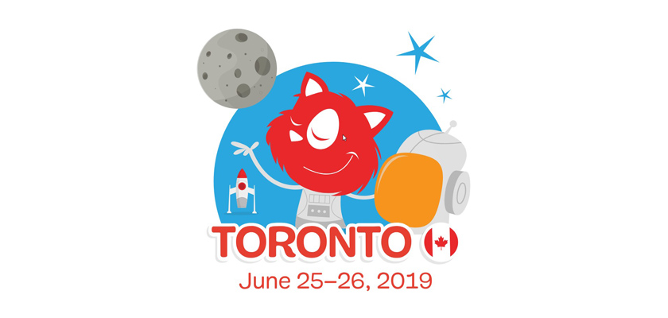

# Cloudinary's Guess the Transformation Challenge: SmashingConf Toronto 2019

### **This challenge involves guessing a Cloudinary transformation URL that produces a given target image from one \(or more\) given source image\(s\).**

##                                              Source Images:

#### Source image \#1: [https://res.cloudinary.com/demo/image/upload/fat\_cat.jpg](https://res.cloudinary.com/demo/image/upload/v1397656470/fat_cat.jpg)

#### Source image \#2: [https://res.cloudinary.com/demo/image/upload/baby\_girl.jpg](https://res.cloudinary.com/demo/image/upload/v1561065585/baby_girl.jpg)

#### Source image \#3: [https://res.cloudinary.com/demo/image/upload/logo.jpg](https://res.cloudinary.com/demo/image/upload/logo.jpg)

##                                              Warm-Up Example:

### [https://res.cloudinary.com/demo/image/upload/c\_crop,g\_faces,r\_25,bo\_15px\_solid\_grey,w\_600/l\_logo,w\_200,h\_200,c\_thumb,g\_face/fl\_layer\_apply,g\_north\_west,x\_20,y\_20/l\_baby\_girl,w\_150,h\_150,c\_thumb,r\_max,bo\_5px\_solid\_pink/fl\_layer\_apply,g\_south\_east,x\_20,y\_20/l\_text:Arial\_30\_bold\_yellow:Chunky%20Cat,g\_north,x\_200,y\_100,co\_yellow/fat\_cat.jpg](https://res.cloudinary.com/demo/image/upload/c_crop,g_faces,r_25,bo_15px_solid_grey,w_600/l_logo,w_200,h_200,c_thumb,g_face/fl_layer_apply,g_north_west,x_20,y_20/l_baby_girl,w_150,h_150,c_thumb,r_max,bo_5px_solid_pink/fl_layer_apply,g_south_east,x_20,y_20/l_text:Arial_30_bold_yellow:Chunky%20Cat,g_north,x_200,y_100,co_yellow/fat_cat.jpg)

### Image Transformations Docs:

### [https://cloudinary.com/documentation/image\_transformations](https://cloudinary.com/documentation/image_transformations)

### Cookbook Recipes \(optional\):

### [https://cloudinary.com/cookbook](https://cloudinary.com/cookbook)

